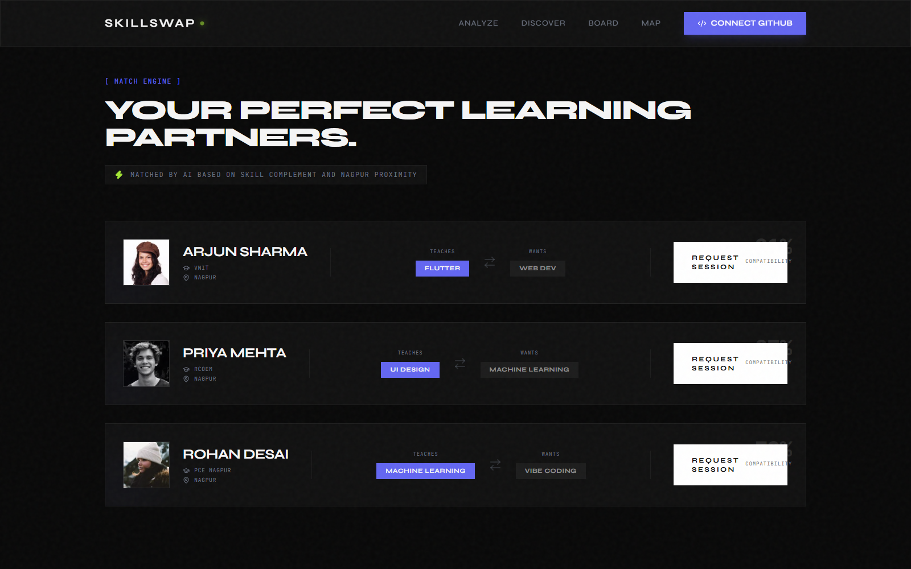
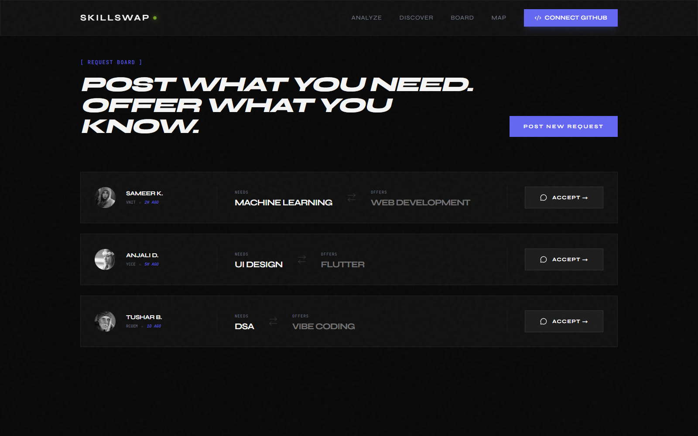

<h1 align="center">SKILLSWAP</h1>

  <strong>Swap skills, not money.</strong> 
  An AI-assisted peer-learning marketplace that helps engineering students
  understand their strengths, find complementary peers, and learn together locally.

  
  
  
  
  

  <a href="#the-idea">The idea</a> ·
  <a href="#product-tour">Product tour</a> ·
  <a href="#how-it-works">How it works</a> ·
  <a href="#quick-start">Quick start</a> ·
  <a href="#current-status">Current status</a>

## The idea

Engineering students often have valuable knowledge but limited access to the right mentors. SkillSwap treats that knowledge as a currency: teach what you know, learn what you need, and build a visible record of progress through real peer sessions.

The Nagpur beta connects students around seven domains:

- Flutter
- Web Development
- UI Design
- Machine Learning
- Data Structures and Algorithms
- Vibe Coding
- Mobile Development

The application combines GitHub portfolio analysis, complementary-skill matching, local college discovery, live learning rooms, guided debriefs, and a lightweight credit system in one coherent experience.

## Product tour

### 1. GitHub skill analysis

Enter a public GitHub username to collect profile and repository metadata. The analysis workflow scores seven skill domains, identifies a top strength, calculates a Skill-Value score, and produces a short technical assessment.

When Groq credentials are configured, the evaluation uses Llama 3.3 70B. Without those credentials, the repository currently returns a deterministic demonstration profile after GitHub data is loaded.

### 2. Complementary peer matching

The match engine presents students who can teach the skill you want and want the skill you can offer. Cards include college, location, Skill-Value, teach/want pairing, and a prototype compatibility score.

### 3. Community request board

Students can post what they need and what they can offer in return. Other learners can accept a request and move directly into a session room.

### 4. Live learning rooms

Each accepted match creates a unique Jitsi room with:

- embedded video, microphone, screen sharing, and fullscreen controls;
- a running session timer;
- shared learning goals;
- an on-demand teaching tip;
- a clear transition into the post-session debrief.

### 5. Session debrief

After a session, learners can describe what they covered and receive a prototype debrief containing:

- key takeaways;
- curated resource cards;
- a short knowledge check;
- session credits.

### 6. Skill profile and city map

The profile turns analysis data into a radar chart, domain bars, teach/learn preferences, credits, and badge placeholders. The city map uses OpenStreetMap and Leaflet to visualize demo skill concentrations across VNIT, YCCE, RCOEM, and PCE Nagpur.

## How it works

    Public GitHub profile
             │
             ▼
    Repository metadata collection
             │
             ▼
    Seven-domain skill evaluation
             │
             ▼
    Skill-Value profile
             │
             ├──────────────► Nagpur skill map
             │
             ▼
    Complementary peer matching
             │
             ▼
    Jitsi learning session
             │
             ▼
    Debrief · quiz · credits · badges

## Architecture

    Browser
    ├── Next.js App Router pages
    ├── React client interactions
    ├── Chart.js skill visualizations
    ├── Leaflet city map
    └── localStorage prototype state
            │
            ▼
    Next.js server analysis workflow
    ├── GitHub profile and repository data
    └── Groq skill evaluation with demo fallback

    External integrations
    ├── Supabase authentication
    ├── Jitsi Meet session rooms
    └── OpenStreetMap tiles

The interface uses server-rendered Next.js pages where possible and client components for charts, maps, animation, local state, and session interactions.

## Feature maturity

| Area | Current implementation | Data source |
|---|---|---|
| Landing experience | Working | Static product copy and animated charts |
| GitHub analyzer | Working when GitHub is configured | Live public profile and repository metadata |
| Skill evaluation | Configurable with fallback | Groq when configured; sample scoring otherwise |
| Authentication | Integrated | Supabase GitHub OAuth |
| Profile | Working prototype | Browser local storage after analysis |
| Match engine | Interactive prototype | Seeded Nagpur peer data |
| Request board | Interactive prototype | Seeded and in-memory browser state |
| City skill map | Working prototype | Seeded college data and OpenStreetMap |
| Video session | Embedded integration | Jitsi Meet room generated from a unique identifier |
| Teaching tip | Simulated prototype | Timed local response |
| Debrief, quiz, and credits | Interactive prototype | Timed local demonstration data |
| Badges | Visual placeholder | Locked cards pending session persistence |

## Technology

| Layer | Technologies |
|---|---|
| Framework | Next.js 16 App Router |
| Interface | React 19, TypeScript, Tailwind CSS 4 |
| Motion and icons | Framer Motion, Lucide React |
| Skill visualization | Chart.js, React Chart.js 2 |
| Maps | Leaflet, React Leaflet, OpenStreetMap |
| Authentication | Supabase |
| Profile analysis | GitHub data and Groq |
| Video rooms | Jitsi Meet |
| Identifiers | Nano ID |

## Quick start

### Requirements

- Node.js 20.9 or newer
- npm
- Optional Supabase project for GitHub sign-in
- GitHub token for profile analysis
- Optional Groq credentials for live skill evaluation

### Install

    git clone https://github.com/mohithadap-dotcom/skills-swap-git-.git
    cd skills-swap-git-
    npm install
    Copy-Item .env.example .env.local
    npm run dev

Open http://localhost:3000.

The landing page, match engine, request board, debrief, and map can be explored without external credentials. Authentication and live GitHub analysis require the corresponding environment values.

## Environment setup

The repository includes [.env.example](.env.example). Copy it to .env.local and replace only the values needed for your workflow.

| Variable | Visibility | Used for |
|---|---|---|
| NEXT_PUBLIC_SUPABASE_URL | Browser-visible | Supabase project connection |
| NEXT_PUBLIC_SUPABASE_ANON_KEY | Browser-visible | Supabase anonymous client access |
| GITHUB_TOKEN | Server-only | GitHub profile and repository requests |
| GROQ_API_KEY | Server-only | Live skill evaluation |

Security notes:

- Never place a Supabase service-role key in a NEXT_PUBLIC variable.
- Keep GitHub and Groq credentials server-only.
- Do not commit .env.local; it is excluded by .gitignore.
- Use the lowest token permissions that satisfy public profile reads.

## Application pages

| Path | Experience |
|---|---|
| / | Product landing page and Nagpur network preview |
| /analyze | GitHub profile analysis and skill radar |
| /profile | Skill identity, preferences, credits, and badge placeholders |
| /match | Complementary peer recommendations |
| /board | Community teach/learn request board |
| /map | College-level skill discovery map |
| /session/[roomId] | Jitsi learning room and peer-assistant panel |
| /debrief | Takeaways, resources, knowledge check, and credit award |

## Available scripts

| Command | Purpose |
|---|---|
| npm run dev | Start the development server |
| npm run build | Create an optimized production build |
| npm run start | Serve the production build |
| npm run lint | Run the repository lint configuration |

## Project structure

    skills-swap-git-/
    ├── public/                 Static assets
    ├── src/
    │   ├── app/
    │   │   ├── analyze/       GitHub analysis experience
    │   │   ├── auth/          Supabase callback
    │   │   ├── board/         Community request board
    │   │   ├── debrief/       Session reflection and quiz
    │   │   ├── map/           Nagpur skill map
    │   │   ├── match/         Peer recommendations
    │   │   ├── profile/       Skill portfolio
    │   │   ├── session/       Jitsi learning rooms
    │   │   ├── globals.css    Design system and global styles
    │   │   └── page.tsx       Landing page
    │   ├── components/        Shared navigation and landing sections
    │   └── lib/               Supabase client and auth helpers
    ├── .env.example           Safe configuration template
    ├── package.json
    └── next.config.ts

## Data and privacy

- Public GitHub profile and repository metadata is processed by the server analysis workflow.
- Analysis results are stored in browser local storage for the prototype profile flow.
- Match, board, college, debrief, credit, and badge data is currently demonstration data.
- Board posts created in the interface are in-memory and disappear after a refresh.
- Video and audio sessions are handled by the embedded Jitsi service.
- Map tiles are requested from OpenStreetMap.
- Supabase handles configured OAuth sessions.

Review the privacy terms of each external service before deploying the project to real users.

## Current status

SkillSwap is a polished functional prototype, not a production marketplace.

### Verified

- Development server renders all main pages.
- The optimized Next.js production build completes successfully.
- TypeScript compilation passes.
- Responsive landing, match, and board layouts render correctly.
- The analyzer, OAuth callback, maps, charts, and dynamic session routes compile.

### Known limitations

- Matching percentages and college statistics are seeded demonstration values.
- User profiles, credits, badges, requests, and session outcomes are not persisted in a shared database.
- Peer-assistant hints and debrief generation are currently simulated.
- Resource links in the sample debrief are placeholders.
- There is no automated test suite yet.
- The strict lint configuration currently reports existing typing, hook, image, and accessibility debt even though the production build passes.
- Jitsi room access is link-based; production deployment needs identity and room-policy controls.
- The methodology button on the landing page is not connected to a separate explanation view.

## Roadmap

- Persist profiles, teach/learn preferences, requests, credits, and badges
- Replace seeded compatibility with explainable matching logic
- Connect debrief generation and resource recommendations to session content
- Add authenticated session invitations and room access controls
- Build moderation, reporting, and trust workflows
- Add unit, component, and end-to-end tests
- Resolve the existing lint and accessibility backlog
- Add measured matching and learning-outcome analytics
- Expand beyond the Nagpur beta

## Contributing

Read [CONTRIBUTING.md](CONTRIBUTING.md) before opening a pull request. Security-sensitive findings should follow [SECURITY.md](SECURITY.md).

## License

No license file is currently included. Unless the repository owner adds one, standard copyright restrictions apply.
